# CSE 15L - Week 8 Lab Report

[Back to Home Page](index.html)

Link to my markdown-parse repository: [Repository Link](https://github.com/justin-chiang/markdown-parser)

Link to repository reviewed in lab: [Repository Link](https://github.com/TheJoeship/markdown-parser-fork)

## Snippet 1

Snippet 1 should produce a list of the links "`google.com", "google.com", and "ucsd.edu".

JUnit test for both my implementation and implementation I am reviewing (same in both test files):
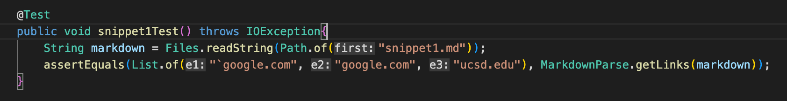

Output for my implementation:
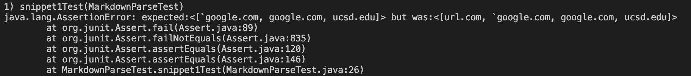

JUnit test for implementation I am reviewing:
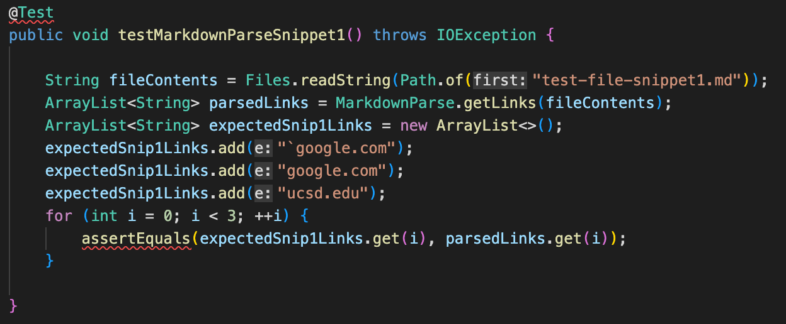

Output for implementation I am reviewing:
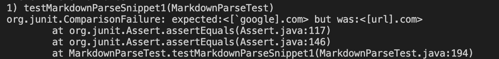

Do you think there is a small (<10 lines) code change that will make your program work for snippet 1 and all related cases that use inline code with backticks? If yes, describe the code change. If not, describe why it would be a more involved change.

For snippet 1, the issue with my output compared to the expected links was the inclusion of the first faulty link, "url.com". In the markdown file for snippet 1, the opening square bracket is within tick marks (`), which denotes the bracket as a string, rather than a proper symbol denoting the beginning of a link. I think that we could implement a conditional to check if either the opening or closing symbol for both the square brackets and parenthesis are within a string, and if so, to disregard that line as a valid link. We could accomplish this with a small code change by finding where the string starts and ends by the index of their quotation marks, and finding if those symbols exist between them.

## Snippet 2

Snippet 2 should produce a list of the links "a.com", "a.com(())" and "example.com".

JUnit test for my implementation:
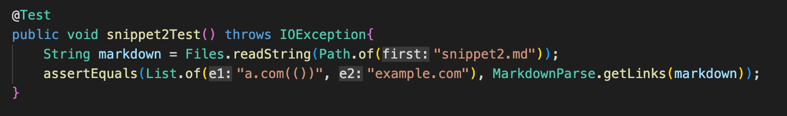

Output for my implementation:
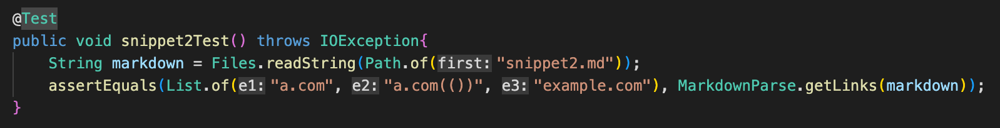

JUnit test for implementation I am reviewing:
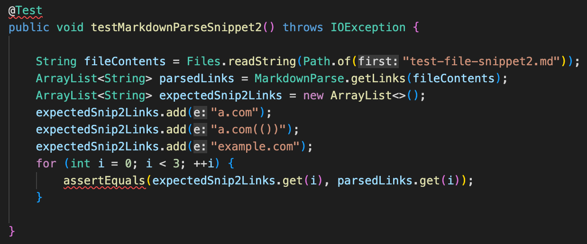

Output for implementation I am reviewing:
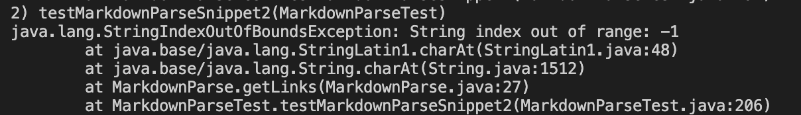

Do you think there is a small (<10 lines) code change that will make your program work for snippet 2 and all related cases that nest parentheses, brackets, and escaped brackets? If yes, describe the code change. If not, describe why it would be a more involved change.

For snippet 2, the issue with my output was a StringIndexOutOfBoundsException, which occured when checking for the character before an opening square bracket symbol. However, had I not had this issue, I think that my code would still be unable to detect the correct links in snippet 2. Snippet 2 contains links with nested symbols within the opening and closing square brackets and parenthesis, which could mess up finding the correct index to begin and end a substring call to obtain the link. I think this could be fixed with a small code change by keeping track of how many symbols have been nested, and matching their corresponding closing symbols until all the nested symbols have been accounted for.

## Snippet 3

Snippet 3 should produce a list of the links "https://www.twitter.com", "https://sites.google.com/eng.ucsd.edu/cse-15l-spring-2022/schedule", and "https://cse.ucsd.edu/".

JUnit test for both my implementation and implementation I am reviewing (same in both test files):
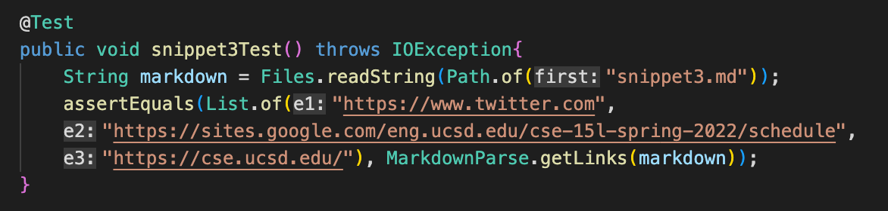

Output for my implementation:
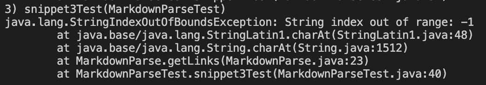

JUnit test for implementation I am reviewing:
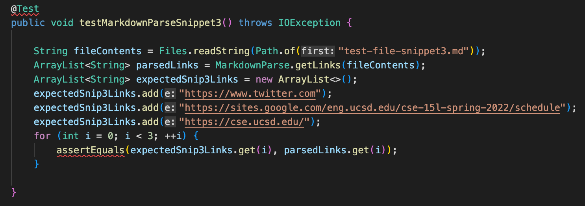

Output for implementation I am reviewing:
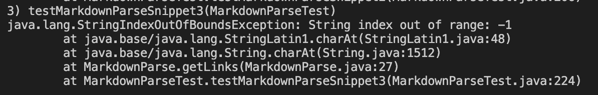

Do you think there is a small (<10 lines) code change that will make your program work for snippet 3 and all related cases that have newlines in brackets and parentheses? If yes, describe the code change. If not, describe why it would be a more involved change.

For snippet 3, the issue with my output is similar to snippet 2, in that I get a StringIndexOutOfBoundsException. However, had I not had this issue, my code would still likely not have been able to detect the correct links in snippet 3. Snippet 3 contains cases where opening and closing symbols occur very far apart from one another, such as on different lines, where some opening symbols do not have a corresponding closing symbol, and where there is whitespace before and after some of the links. I think this would require a more involved code change to fix, as there would have to be separate fixes for each of these cases. Some fixes would include checking if another valid link exists after a potential link does not have a closing symbol, and removing whitespace in a substringed link.

[Back to Home Page](index.html)
