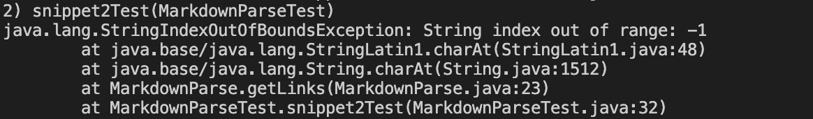

# CSE 15L - Week 8 Lab Report

[Back to Home Page](index.html)

Link to markdown-parse repository: [Repository Link](https://github.com/justin-chiang/markdown-parser)

Link to repository reviewed in lab: [Repository Link](https://github.com/TheJoeship/markdown-parser-fork)

## Snippet 1

Snippet 1 should produce a list of the links "`google.com", "google.com", and "ucsd.edu".
JUnit test for both my implementation and implementation I am reviewing (same in both test files):

Output for my implementation:

Output for implementation I am reviewing:

Do you think there is a small (<10 lines) code change that will make your program work for snippet 1 and all related cases that use inline code with backticks? If yes, describe the code change. If not, describe why it would be a more involved change.

## Snippet 2

Snippet 2 should produce a list of the links "a.com(())" and "example.com".
JUnit test for both my implementation and implementation I am reviewing (same in both test files):

Output for my implementation:

Output for implementation I am reviewing:

Do you think there is a small (<10 lines) code change that will make your program work for snippet 2 and all related cases that nest parentheses, brackets, and escaped brackets? If yes, describe the code change. If not, describe why it would be a more involved change.

## Snippet 3

Snippet 3 should produce a list of the links "https://www.twitter.com", "https://sites.google.com/eng.ucsd.edu/cse-15l-spring-2022/schedule", and "https://cse.ucsd.edu/".
JUnit test for both my implementation and implementation I am reviewing (same in both test files):

Output for my implementation:

Output for implementation I am reviewing:

Do you think there is a small (<10 lines) code change that will make your program work for snippet 3 and all related cases that have newlines in brackets and parentheses? If yes, describe the code change. If not, describe why it would be a more involved change.

[Back to Home Page](index.html)
