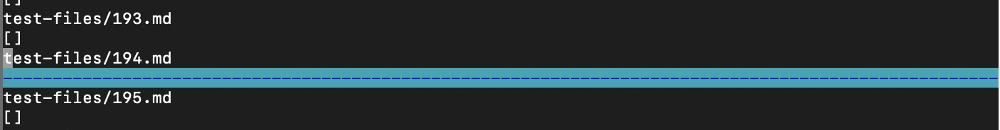
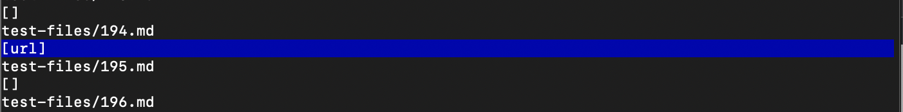
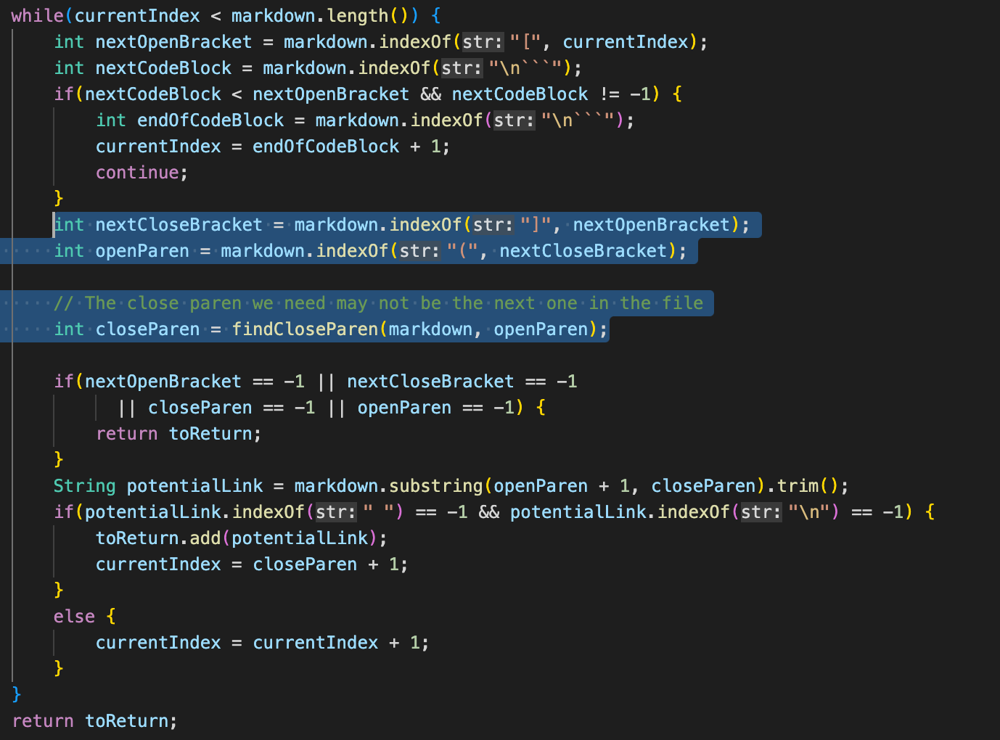
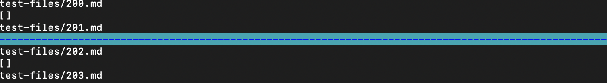
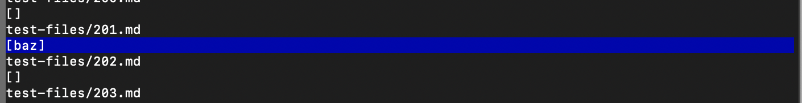
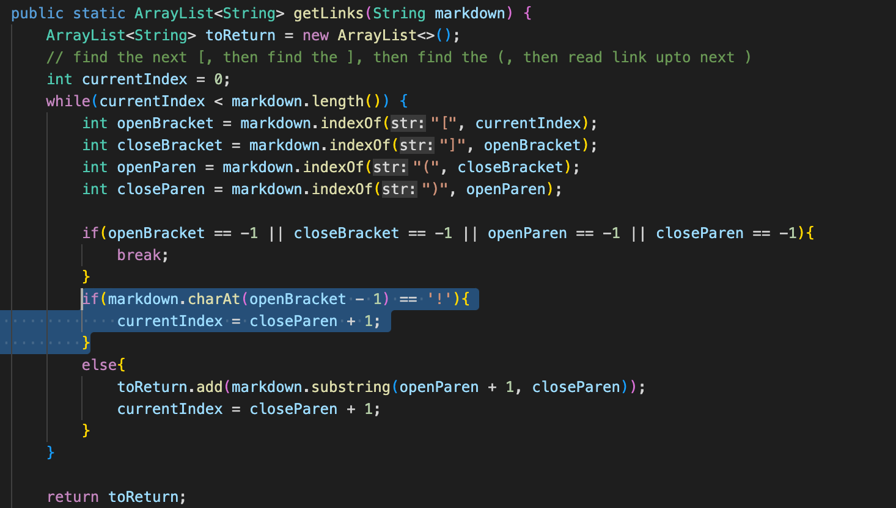

# CSE 15L - Week 10 Lab Report

[Back to Home Page](index.html)

For the two files for which the output for my implementation differed from the given implementation, I used vimdiff to find the differences
between them by comparing their two results.txt files. The two files I will be discussing are 194.md and 201.md.

Link to 194.md: [Link to 194.md](https://github.com/justin-chiang/markdown-parser/blob/main/test-files/194.md)

Link to 201.md: [Link to 201.md](https://github.com/justin-chiang/markdown-parser/blob/main/test-files/201.md)

## 194.md

Neither implementation is correct; both produced the incorrect output.

My implementation's output did not return anything:

Given implementation's output returned a list of just "url":

Using VSCode preview, the expected output should be an empty list, as there are no valid links.

For the given implementation's faulty output, the list of just "url" comes from only checking for the substring in between opening and closing parenthesis 
following opening and closing square brackets. However, it does not check whether or not it comes directly after the square brackets, and if the link 
itself is valid. The following highlighted code in getLinks shows how the index of the opening parenthesis is found by finding the indexOf starting from the closing square 
bracket; however, this should be fixed to include the conditions mentioned.

## 201.md

Neither implementation is correct; both produced the incorrect output.

My implementation's output did not return anything:

Given implementation's output returned a list of just "baz":

Using VSCode preview, the expected output should be an empty list, as there are no valid links.

For my implementation's faulty output, the output of nothing signifies that there may have been an exception thrown while the program was running. Running 
java MarkdownParse test-files/201.md in terminal allows us to see that there is a StringIndexOutOfBoundsException with an index of -1 when running my version 
of MarkdownParse; this occurs on the line checking for a "!" character that may potentially come before a square bracket. However, if the square bracket occurs 
at the first index, checking for the index of "!" would yield an index of -1, which causes the error. The following highlighted code in getLinks shows the line with this error, 
and to fix it, we should include a statement that checks if the current index is not 0.

[Back to Home Page](index.html)
